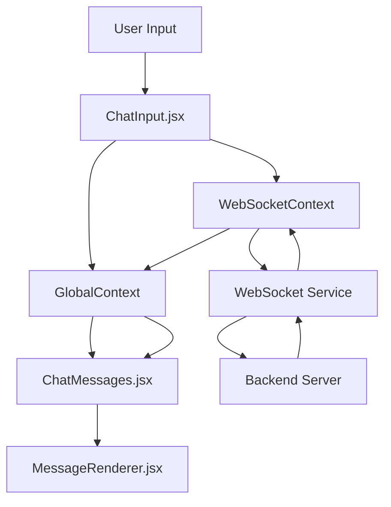

# TÀI LIỆU CHATBOX COMPONENT

## 📋 MỤC LỤC

1. [Giới thiệu](#giới-thiệu)
2. [Cấu trúc thư mục](#cấu-trúc-thư-mục)
3. [Quy tắc thiết kế](#quy-tắc-thiết-kế)
4. [Chi tiết các component](#chi-tiết-các-component)
5. [Luồng dữ liệu](#luồng-dữ-liệu)
6. [Cấu hình và môi trường](#cấu-hình-và-môi-trường)
7. [Hướng dẫn sử dụng](#hướng-dẫn-sử-dụng)
8. [Tính năng nâng cao](#tính-năng-nâng-cao)
9. [Troubleshooting](#troubleshooting)

---

## 🎯 GIỚI THIỆU

**ChatBox** là một hệ thống chat interface hiện đại được xây dựng với React, hỗ trợ:

- ✨ Markdown rendering với LaTeX math
- 🔄 WebSocket real-time communication với HTTP fallback
- 📎 File upload và attachment (drag & drop support)
- 🎨 UI/UX responsive và hiện đại
- ⚡ Auto-resize textarea (1-3 dòng)
- 🚀 Container pattern có thể tái sử dụng
- 🔄 Infinite scroll cho message history
- 💾 Context-based conversation management
- 📊 JSON data formatting với metadata extraction
- 🗄️ Database update modal cho extracted metadata
- ❌ Error handling với retry functionality

---

## 📁 CẤU TRÚC THƯ MỤC

```
src/components/chatbox/
│
├── 📄 ChatBoxContainer.jsx          # Container chính
├── 📄 index.js                      # Export module
├── 📄 README.md                     # Documentation cơ bản
├── 📄 CHATBOX_DOCUMENTATION.md      # Documentation chi tiết
│
└── 📂 chatboxElements/              # Thư mục chứa các elements
    ├── 📄 ChatHeader.jsx           # Header với model selector & classifier
    ├── 📄 ChatMessages.jsx         # Messages display với infinite scroll
    ├── 📄 ChatInput.jsx            # Input area với file upload & drag-drop
    ├── 📄 ChatSidebar.jsx          # Sidebar cho context history
    ├── 📄 ConnectionDebugPanel.jsx # Connection status display
    └── 📄 TypingIndicator.jsx      # Animation typing indicator
```

### 🏗️ Cấu trúc liên quan:

```
src/
├── components/
│   ├── chatbox/                     # 📂 Main chatbox module
│   ├── MessageRenderer.jsx          # 📄 Shared message renderer
│   ├── ModelSelector.jsx            # 📄 AI model selection dropdown
│   └── UpdateDatabaseModal.jsx      # 📄 Database update modal
├── contexts/
│   ├── GlobalContext.jsx           # 📄 Global state management
│   ├── WebSocketContext.jsx        # 📄 WebSocket connection
│   ├── ChatContext.jsx             # 📄 Chat conversation context
│   └── ModelContext.jsx            # 📄 Model selection context
├── config/
│   └── config.js                   # 📄 Environment configuration
├── services/
│   ├── WebSocketService.js         # 📄 WebSocket service layer
│   └── ChatAPIService.js           # 📄 HTTP API service
└── utils/
    └── textFormatter.js            # 📄 JSON & metadata formatting
```

---

## 📐 QUY TẮC THIẾT KẾ

### 🎨 **Container-Elements Pattern**

1. **Container Component**: 
   
   - Chứa logic chính và layout tổng thể
   - Quản lý state và data flow
   - Import và sử dụng các elements

2. **Elements Folder**: 
   
   - Chứa các components con được tách biệt
   - Mỗi element có một nhiệm vụ cụ thể
   - Có thể tái sử dụng và test độc lập

### 🔧 **Naming Convention**

- **Container**: `[ModuleName]Container.jsx`
- **Elements Folder**: `[moduleName]Elements/`
- **Element Files**: `[ElementName].jsx`
- **Export File**: `index.js`

### 📦 **Import/Export Structure**

```javascript
// index.js - Centralized exports
export { default as ChatBoxContainer } from './ChatBoxContainer';
export { default as ChatHeader } from './chatboxElements/ChatHeader';
// ...

// Usage
import { ChatBoxContainer } from './components/chatbox';
```

---

## 🧩 CHI TIẾT CÁC COMPONENT

### 🎪 **ChatBoxContainer.jsx**

> **Vai trò**: Container chính, điều phối toàn bộ chat interface

**Props**: 

- Không có props trực tiếp, sử dụng contexts

**State Management**:

- `GlobalContext`: Quản lý messages toàn cục
- `ChatContext`: Quản lý conversation context và history
- `classifierCode`: State cho classifier selector (tra_cuu_thong_tin, trich_xuat_thong_tin)
- `replyHandlerRef`: Ref để xử lý reply functionality
- `fileInputRef`: Ref để xử lý drag-drop files từ chat area

**Layout Structure**:

```jsx
<div className="w-full h-full bg-gray-50 flex">
  <ChatSidebar />          {/* Sidebar với context history */}
  <div className="flex-1 flex flex-col">
    <ChatHeader />         {/* Header với model & classifier selector */}
    <ConnectionDebugPanel /> {/* Connection status */}
    <div className="flex-1"> {/* Messages area - flex grow */}
      <ChatMessages 
        onReply={handleReply}
        onFileDrop={handleFileDrop} 
      />
    </div>
    <div className="border-t"> {/* Input area - fixed height */}
      <ChatInput 
        onSetReply={handleSetReply}
        classifierCode={classifierCode}
        onClassifierCodeChange={setClassifierCode}
        onSetFileInput={handleSetFileInput}
      />
    </div>
  </div>
</div>
```

**Tính năng**:

- ✅ Full viewport layout với sidebar
- ✅ Reply functionality với ref pattern
- ✅ Drag & drop files từ chat area
- ✅ Classifier code management
- ✅ Responsive design

---

### 🎭 **ChatHeader.jsx**

> **Vai trò**: Header hiển thị model selector, classifier selector và connection status

**Dependencies**:

```javascript
import { useWebSocket } from '../../../contexts/WebSocketContext';
import { useModel } from '../../../contexts/ModelContext';
import ModelSelector from '../../ModelSelector';
import Config from '../../../config/config';
```

**Features**:

- 🤖 **Model Selection Dropdown** - Chọn AI model (GPT-4, Claude, etc.)
- 🏷️ **Classifier Code Selector** - Chọn loại xử lý (Tra cứu thông tin / Trích xuất thông tin)
- 🔴🟡🟢 **Real-time connection status** với color coding
- 📱 **Horizontal scroll** cho mobile (scrollbar-hide)
- 🎨 **Gradient branding** với CHATBOX icon

**Classifier Options**:

```javascript
const classifierOptions = [
  { value: 'tra_cuu_thong_tin', label: 'Tra cứu thông tin' },
  { value: 'trich_xuat_thong_tin', label: 'Trích xuất thông tin' }
];
```

**Auto-reset Behavior**:

- ClassifierCode tự động reset về `tra_cuu_thong_tin` sau mỗi message gửi đi

**Status States**:

- `connected`: Green + "✓ Đã kết nối"
- `reconnecting`: Yellow + "⚡ Đang kết nối lại..." với pulse dots
- `failed`: Red + "❌ Kết nối thất bại" + Retry button

**Responsive Behavior**:

- Desktop: Full layout với tất cả elements
- Mobile: Horizontal scroll, compact spacing

---

### 💬 **ChatMessages.jsx**

> **Vai trò**: Hiển thị messages với infinite scroll, navigation, và drag-drop support

**Props**:

```javascript
interface ChatMessagesProps {
  messages: Array<Message>
  onReply: (messageId, content) => void
  onFileDrop: (files) => void
}
```

**Key Features**:

- 📜 **Infinite scroll** - Load more messages khi scroll lên top
- 🎭 **Typing indicator** khi đang chờ response
- 🔄 **Message navigation** - Navigate giữa các replies (repByMessIds)
- 📁 **Drag & drop file upload** - Kéo thả file vào chat area
- 🎨 **Welcome screen** khi chưa có messages
- 🔄 **Message rendering** qua MessageRenderer component

**ChatContext Integration**:

```javascript
const {
  currentMessages,
  hasMoreMessages,
  loadMoreMessages,
  isLoadingMessages,
  isWaitingForResponse,
  navigateToMessage,
  retryLastMessage
} = useChatContext();
```

**Infinite Scroll Logic**:

```javascript
const handleScroll = useCallback(async () => {
  const container = scrollContainerRef.current;
  if (container.scrollTop < 50 && hasMoreMessages && !isLoadingMessages) {
    setIsLoadingMore(true);
    setPrevScrollHeight(container.scrollHeight);
    await loadMoreMessages();
    // Restore scroll position
    container.scrollTop = container.scrollHeight - prevScrollHeight;
  }
}, [hasMoreMessages, isLoadingMessages]);
```

**Drag & Drop Implementation**:

```javascript
const handleDragOver = (e) => {
  e.preventDefault();
  setIsDragging(true);
};

const handleDrop = (e) => {
  e.preventDefault();
  setIsDragging(false);
  const files = Array.from(e.dataTransfer.files);
  if (files.length > 0) {
    onFileDrop(files); // Pass to ChatInput via container
  }
};

// Visual feedback
{isDragging && (
  <div className="drag-overlay">
    📁 Thả file vào đây để tải lên
  </div>
)}
```

**Message Navigation**:

- Hiển thị navigation buttons khi message có multiple replies (repByMessIds)
- Navigate backward/forward qua các reply branches
- Pagination display: "1/3", "2/3", etc.

**Error Handling**:

- Pass `onRetry` handler cho error messages
- Trigger `retryLastMessage()` từ ChatContext

---

### ⌨️ **ChatInput.jsx**

> **Vai trò**: Input area với auto-resize, file upload, drag-drop và auto-upload

**State Management**:

```javascript
const [message, setMessage] = useState('');
const [selectedFiles, setSelectedFiles] = useState([]); // Raw File objects
const [uploadedFiles, setUploadedFiles] = useState([]); // Files with upload status
const [replyToMessageId, setReplyToMessageId] = useState(null);
const [replyToContent, setReplyToContent] = useState('');
```

**🎯 Core Feature: Auto-resize Textarea**

```javascript
const adjustTextareaHeight = () => {
  if (textareaRef.current) {
    textareaRef.current.style.height = 'auto';
    const scrollHeight = textareaRef.current.scrollHeight;
    const lineHeight = 24;
    const maxLines = 3;
    const minHeight = lineHeight * 1; // 1 dòng
    const maxHeight = lineHeight * maxLines; // 3 dòng

    const newHeight = Math.min(Math.max(scrollHeight, minHeight), maxHeight);
    textareaRef.current.style.height = newHeight + 'px';
  }
};
```

**📎 File Upload System**:

**Auto-upload on selection**:
```javascript
useEffect(() => {
  const uploadNewFiles = async () => {
    for (const file of newFiles) {
      const formData = new FormData();
      formData.append('file', file);
      
      const response = await chatAPIService.uploadFiles(formData, onProgress);
      // Response: { opaiFileId, originInfo: {fileName, fileSize, mimeType}, localPath }
      
      if (response && response.opaiFileId) {
        setUploadedFiles(prev => prev.map(f =>
          f.id === tempId ? { ...f, status: 'success', fileData: response } : f
        ));
      }
    }
  };
  uploadNewFiles();
}, [selectedFiles]);
```

**File states**:
- `uploading`: Yellow badge với spinner
- `success`: Blue badge với file info
- `error`: Red badge với error message

**Drag & Drop from Chat Area**:
```javascript
// Expose file input function to parent
useEffect(() => {
  if (onSetFileInput) {
    onSetFileInput((files) => {
      setSelectedFiles(prev => [...prev, ...files]);
    });
  }
}, [onSetFileInput]);
```

**📨 Message Sending**:

**Payload structure**:
```javascript
const payload = {
  model: selectedModel,
  message: message,
  classifierCode: classifierCode, // Optional
  files: uploadedFiles.map(f => f.fileData), // Array of file objects
  contextId: currentContextId, // For continuing conversation
  messageId: lastMessageId // For message chaining
};
```

**Reply functionality**:
```javascript
// Register reply handler
useEffect(() => {
  if (onSetReply) {
    onSetReply((messageId, content) => {
      setReplyToMessageId(messageId);
      setReplyToContent(content);
      textareaRef.current?.focus();
    });
  }
}, [onSetReply]);

// Show reply preview
{replyToMessageId && (
  <div className="reply-preview">
    <BiReply /> Đang trả lời: {replyToContent.slice(0, 50)}...
    <AiOutlineClose onClick={handleCancelReply} />
  </div>
)}
```

**🔄 Auto-reset after send**:
- Clear message và files
- Reset reply state
- Reset classifierCode về `tra_cuu_thong_tin`

**Keyboard Shortcuts**:

- `Enter`: Gửi tin nhắn
- `Shift + Enter`: Xuống dòng mới

---

### ⏳ **TypingIndicator.jsx**

> **Vai trò**: Animation hiển thị khi bot đang typing

**Animation Implementation**:

```javascript
<div className="flex space-x-1">
  <div className="w-2 h-2 bg-gray-400 rounded-full animate-bounce"></div>
  <div className="w-2 h-2 bg-gray-400 rounded-full animate-bounce" 
       style={{ animationDelay: '0.1s' }}></div>
  <div className="w-2 h-2 bg-gray-400 rounded-full animate-bounce" 
       style={{ animationDelay: '0.2s' }}></div>
</div>
```

**Usage**:

```javascript
<TypingIndicator isVisible={isTyping} />
```

**Conditional Rendering**:

- Chỉ hiển thị khi `isVisible = true`
- Tự động ẩn sau 2 giây
- Trigger khi user gửi message

---

## 🔄 LUỒNG DỮ LIỆU

### 📊 **Data Flow Architecture**



### 🎭 **Context Structure**

**GlobalContext**:

```javascript
{
  messages: [], // Array of user/bot messages
  addMessage: (message) => {},
  handleBotResponse: (response) => {},
  clearMessages: () => {},
  sessionHistory: [],
  // ...
}
```

**WebSocketContext**:

```javascript
{
  connectionStatus: 'connected|connecting|disconnected|error',
  isConnected: boolean,
  sendMessage: (message) => {},
  lastMessage: object,
  error: object,
  // ...
}
```

### 🔄 **Message Flow Sequence**

1. **User Input** → ChatInput.jsx
2. **Validation** → Check message/files not empty
3. **Add to UI** → addMessage(userMessage)
4. **WebSocket Send** → sendMessage(wsMessage)
5. **Bot Response** → Auto or real response
6. **Update UI** → addMessage(botMessage)
7. **Auto-scroll** → ScrollToBottom()

---

## ⚙️ CẤU HÌNH VÀ MÔI TRƯỜNG

### 🌍 **Environment Variables**

**.env.development**:

```env
VITE_BACKEND_URL=black.irdop.org
VITE_APP_ID=LIMS-IRDOP-DEV
VITE_WEBSOCKET_URL=ws://black.irdop.org/ws
```

**.env.production**:

```env
VITE_BACKEND_URL=red.irdop.org
VITE_APP_ID=LIMS-IRDOP-PRD
VITE_WEBSOCKET_URL=wss://red.irdop.org/ws
```

### 🔧 **Config.js Usage**

```javascript
import Config from '../../../config/config';

// Sử dụng
Config.backendUrl    // 'black.irdop.org' or 'red.irdop.org'
Config.appId         // 'LIMS-IRDOP-DEV' or 'LIMS-IRDOP-PRD'
Config.websocketUrl  // 'ws://...' or 'wss://...'
Config.isDevelopment // true/false
Config.isProduction  // true/false
```

### 📦 **Dependencies**

**Core Dependencies**:

```json
{
  "react": "^18.3.1",
  "react-dom": "^18.3.1",
  "react-icons": "^5.4.0",
  "react-markdown": "latest",
  "rehype-katex": "latest",
  "remark-math": "latest",
  "katex": "latest"
}
```

**CSS Framework**:

- TailwindCSS với các utility classes
- KaTeX CSS cho LaTeX math rendering

---

## 📖 HƯỚNG DẪN SỬ DỤNG

### 🚀 **Cài đặt và khởi chạy**

```bash
# Clone và cài đặt
npm install

# Development mode
npm run dev

# Production build
npm run build

# Production mode
npm run build:dev
```

### 💡 **Import và sử dụng**

**Basic Usage**:

```javascript
import { ChatBoxContainer } from './components/chatbox';

function App() {
  return (
    <WebSocketProvider>
      <GlobalProvider>
        <div className="w-screen h-screen">
          <ChatBoxContainer />
        </div>
      </GlobalProvider>
    </WebSocketProvider>
  );
}
```

**Advanced Usage** - Custom Container:

```javascript
import { 
  ChatHeader, 
  ChatMessages, 
  ChatInput 
} from './components/chatbox';

function CustomChatContainer() {
  return (
    <div className="custom-layout">
      <ChatHeader />
      <div className="custom-messages">
        <ChatMessages messages={messages} />
      </div>
      <ChatInput />
    </div>
  );
}
```

### 🎯 **Customization Options**

**Styling Customization**:

```javascript
// Override Tailwind classes
<ChatBoxContainer className="custom-bg custom-height" />
```

**Message Formatting**:

```javascript
// Custom message structure
const customMessage = {
  user: { 
    content: "Hello **world**! $E = mc^2$",
    attachments: [file1, file2] 
  }
};
```

---

## 🔥 TÍNH NĂNG NÂNG CAO

### � **JSON Data Formatting & Metadata Extraction**

**textFormatter.js** - Utility cho việc format và extract data:

```javascript
// Process response to extract metadata
const processResponse = (content) => {
  try {
    const jsonMatch = content.match(/```json\n([\s\S]*?)\n```/);
    if (jsonMatch) {
      const jsonData = JSON.parse(jsonMatch[1]);
      
      // Extract metadata if exists
      if (jsonData.metadata) {
        return {
          content: formatObjectToCustomText(jsonData),
          metadata: jsonData.metadata,
          hasMetadata: true
        };
      }
      
      return {
        content: formatObjectToCustomText(jsonData),
        metadata: null,
        hasMetadata: false
      };
    }
  } catch (error) {
    console.error('Error processing response:', error);
  }
  
  return { content, metadata: null, hasMetadata: false };
};
```

**Format rules**:
- Object keys in **bold** markdown format
- Nested objects với 2-space indentation
- Multiline/table values preserved without indentation
- Arrays formatted as markdown lists

### 🗄️ **Database Update Modal**

**UpdateDatabaseModal.jsx** - Modal cho việc cập nhật CSDL:

**Features**:
- 📊 **Dual table display**: Main data + Metadata
- 🎯 **Table selector**: Phương pháp (protocol) / Phép thử (parameter)
- ✅ **Confirmation dialog** trước khi update
- 📱 **Responsive design** với max-width: 7xl

**Table structure**:
```javascript
// Object Key column: 250px fixed width, left-aligned, top-aligned
// Object Value column: Flexible width, với JSON formatting

<table>
  <thead>
    <tr>
      <th style={{ width: '250px' }}>Object Key</th>
      <th>Object Value</th>
    </tr>
  </thead>
  <tbody>
    {entries.map(([key, value]) => (
      <tr>
        <td className="align-top">{key}</td>
        <td className="align-top">
          <pre>{formatValue(value)}</pre>
        </td>
      </tr>
    ))}
  </tbody>
</table>
```

**Update flow**:
1. User clicks "Cập nhật CSDL" button (chỉ hiện khi có metadata)
2. Modal opens với data tables
3. User chọn target table (Phương pháp / Phép thử)
4. Nút "Cập nhật" chỉ hiện khi đã chọn table
5. Confirmation dialog
6. Success notification

### ❌ **Error Handling & Retry**

**Error detection**:
```javascript
// In GlobalContext.handleBotResponse
if (response.error || (response.payload && response.payload.error)) {
  const errorMessage = {
    messageId: `error-${Date.now()}`,
    message: {
      role: 'assistant',
      content: errorMessage
    },
    isError: true
  };
  addMessage(errorMessage);
}
```

**Error display**:
- ⚠️ Red-themed message box
- "Có lỗi xảy ra" header
- Error details
- 🔄 "Thử lại" button

**Retry mechanism**:
```javascript
// ChatContext.retryLastMessage
const retryLastMessage = useCallback(() => {
  const userMessages = currentMessages.filter(m => m.message?.role === 'user');
  const lastUserMessage = userMessages[userMessages.length - 1];
  
  // Remove error messages after last user message
  const lastUserIndex = currentMessages.findIndex(m => m.messageId === lastUserMessage.messageId);
  setCurrentMessages(prev => prev.slice(0, lastUserIndex + 1));
  
  // Resend message
  globalContext?.resendMessage(lastUserMessage);
}, [currentMessages, globalContext]);
```

### 🔄 **Context & Conversation Management**

**ChatContext.jsx** - Quản lý conversation contexts:

**Key features**:
- 📝 Multiple conversation contexts
- 🔄 Context switching
- 📜 Infinite scroll message loading
- 🔗 Message chaining với prevMessId
- 🌲 Reply branching với repByMessIds

**Context structure**:
```javascript
{
  contextId: string,
  messageIds: string[],
  createdAt: timestamp,
  updatedAt: timestamp,
  // ... other fields
}
```

**Message chaining**:
```javascript
// When sending message
payload.messageId = lastMessageId; // Continue chain

// When replying to specific message
payload.messageId = replyToMessageId; // Break chain and start new branch
```

**Navigation between replies**:
```javascript
// Message with multiple replies
message = {
  messageId: "msg_1",
  repByMessIds: ["reply_1", "reply_2", "reply_3"]
};

// Navigate between replies
<div className="navigation">
  <button onClick={() => navigateToPrev()}>←</button>
  <span>2/3</span>
  <button onClick={() => navigateToNext()}>→</button>
</div>
```

### �📝 **Markdown & LaTeX Support**

**Markdown Features**:

- Headers (H1, H2, H3)
- **Bold**, *italic* text
- `Inline code` và code blocks
- Lists (ordered/unordered)
- Tables
- Blockquotes
- Links và images

**LaTeX Math Rendering**:

```markdown
Inline math: $E = mc^2$

Block math:
$$\sum_{i=1}^{n} i = \frac{n(n+1)}{2}$$

Complex equations:
$$f(x) = \int_{-\infty}^{\infty} \hat{f}(\xi) e^{2 \pi i \xi x} d\xi$$
```

### 📎 **File Upload System**

**Supported File Types**:

- All file types supported
- API returns: `{ opaiFileId, originInfo: {fileName, fileSize, mimeType}, localPath }`

**Upload Flow**:

1. **File Selection**:
   - Click attach button
   - Drag & drop in input area
   - Drag & drop in chat area (forwarded to input)

2. **Auto-upload**:
   ```javascript
   // Watch selectedFiles changes
   useEffect(() => {
     for (const file of newFiles) {
       // Upload with progress tracking
       const response = await chatAPIService.uploadFiles(formData, onProgress);
       
       // Store complete response object
       setUploadedFiles(prev => [...prev, {
         id: tempId,
         file: file,
         status: 'success',
         fileData: response, // Complete API response
         progress: 100
       }]);
     }
   }, [selectedFiles]);
   ```

3. **Display**:
   - Uploading: Yellow badge + progress
   - Success: Blue badge + file info
   - Error: Red badge + error message

4. **Sending**:
   ```javascript
   // Include files array in payload
   payload.files = uploadedFiles
     .filter(f => f.status === 'success')
     .map(f => f.fileData); // Send complete file objects
   ```

**File Display in Messages**:
```javascript
// User/Bot messages
{(attachments || files) && (
  <div className="attachments">
    {attachments.map(file => (
      <div className="file-item">
        <span>📎</span>
        <div>
          <div>{file.originInfo?.fileName}</div>
          <div>{formatFileSize(file.originInfo?.fileSize)}</div>
        </div>
      </div>
    ))}
  </div>
)}
```

### 🔌 **WebSocket Integration**

**Dual Mode Support**:
- WebSocket: Real-time communication
- HTTP Fallback: Khi WebSocket không available

**Connection States**:

```javascript
const connectionStates = {
  CONNECTING: 'connecting',
  CONNECTED: 'connected', 
  RECONNECTING: 'reconnecting',
  FAILED: 'failed'
};
```

**ConnectionDebugPanel.jsx** - Status display:

```javascript
// HTTP-Only Mode
<div className="status">
  📡 HTTP-Only Mode | {Config.backendUrl}
</div>

// Reconnecting
<div className="status">
  ⚡ Đang kết nối lại... | {attemptCount}/{maxAttempts}
  <div className="pulse-dots">
    <span style={{ animationDelay: '0s' }}>●</span>
    <span style={{ animationDelay: '0.2s' }}>●</span>
    <span style={{ animationDelay: '0.4s' }}>●</span>
  </div>
</div>

// Failed
<div className="status">
  ❌ Kết nối thất bại | {maxAttempts}/{maxAttempts}
  <button onClick={handleRetry}>Thử lại</button>
</div>
```

**Auto-reconnection**:

```javascript
// Exponential backoff strategy
const reconnectDelay = Math.min(1000 * Math.pow(2, attemptNumber), 30000);
const maxAttempts = 5;
```

**Message Protocol**:

```javascript
// Outgoing (WebSocket)
{
  type: 'chat_message',
  endpoint: '/ws/v1/gen_ai/chat',
  data: {
    model: string,
    message: string,
    classifierCode?: string,
    files?: Array<FileObject>,
    contextId?: string,
    messageId?: string
  },
  timestamp: ISO_STRING,
  appId: string
}

// Outgoing (HTTP)
POST /api/v1/gen_ai/chat
{
  model: string,
  message: string,
  classifierCode?: string,
  files?: Array<FileObject>,
  contextId?: string,
  messageId?: string
}

// Incoming (Both)
{
  payload: {
    messageId: string,
    contextId: string,
    message: {
      role: 'assistant' | 'system',
      content: string
    },
    model: string,
    classifierCode?: string,
    createdAt: ISO_STRING,
    prevMessId?: string,
    repByMessIds?: string[]
  },
  error?: string // If error occurred
}
```

---

## 🚨 TROUBLESHOOTING

### ❌ **Lỗi thường gặp**

**1. WebSocket Connection Failed**

```
Symptom: Connection status shows "Lỗi kết nối"
Solution: 
- Kiểm tra VITE_WEBSOCKET_URL trong .env
- Verify backend server đang chạy
- Check firewall settings
```

**2. Messages không hiển thị**

```
Symptom: Messages array empty hoặc không update
Solution:
- Verify GlobalContext được wrap đúng
- Check addMessage function
- Debug với React DevTools
```

**3. Auto-resize không hoạt động**

```
Symptom: Textarea không tự động thay đổi height
Solution:
- Check textareaRef.current exists
- Verify adjustTextareaHeight được gọi
- Debug với browser DevTools
```

**4. LaTeX không render**

```
Symptom: Math formulas hiển thị dạng raw text
Solution:
- Import 'katex/dist/katex.min.css'
- Check rehype-katex và remark-math installed
- Verify syntax: $inline$ hoặc $$block$$
```

### 🔍 **Debug Tools**

**React DevTools**:

```javascript
// Check contexts
- GlobalContext state
- WebSocketContext connection
- Component props/state
```

**Browser DevTools**:

```javascript
// Network tab
- WebSocket connection status
- Message send/receive

// Console
- Error messages
- WebSocket events
- Component lifecycle logs
```

**Vite Dev Tools**:

```bash
# Hot reload
- File changes auto-reload
- Environment variable changes

# Build analysis
npm run build -- --analyze
```

### 🛠️ **Performance Optimization**

**Message Rendering**:

```javascript
// Virtualization for large message lists
const shouldVirtualize = messages.length > 100;

// Memoization for expensive operations
const MemoizedMessageRenderer = React.memo(MessageRenderer);
```

**WebSocket Optimization**:

```javascript
// Message batching
const messageBatch = [];
const flushBatch = debounce(() => {
  // Send batched messages
}, 100);
```

**Bundle Size**:

```bash
# Analyze bundle
npm run build
npx vite-bundle-analyzer

# Optimization strategies
- Code splitting
- Lazy loading
- Tree shaking
```

---

## 📞 **HỖ TRỢ & LIÊN HỆ**

### 📧 **Báo lỗi và góp ý**

- GitHub Issues: [Repository URL]
- Email: [Contact Email]
- Documentation: [Docs URL]

### 🎯 **Roadmap tính năng**

- [ ] Voice message support
- [ ] Image paste from clipboard  
- [ ] Message search functionality
- [ ] Custom themes system
- [ ] Mobile app integration
- [ ] Offline mode support

### 📚 **Tài liệu tham khảo**

- [React Documentation](https://react.dev)
- [TailwindCSS Docs](https://tailwindcss.com)
- [KaTeX Documentation](https://katex.org)
- [react-markdown Guide](https://github.com/remarkjs/react-markdown)

---

**📅 Cập nhật lần cuối**: 24/11/2025  
**👨‍💻 Phiên bản**: 2.0.0  
**🏷️ Tags**: React, WebSocket, Chat, Markdown, LaTeX, TailwindCSS, Infinite-Scroll, File-Upload, Context-Management
